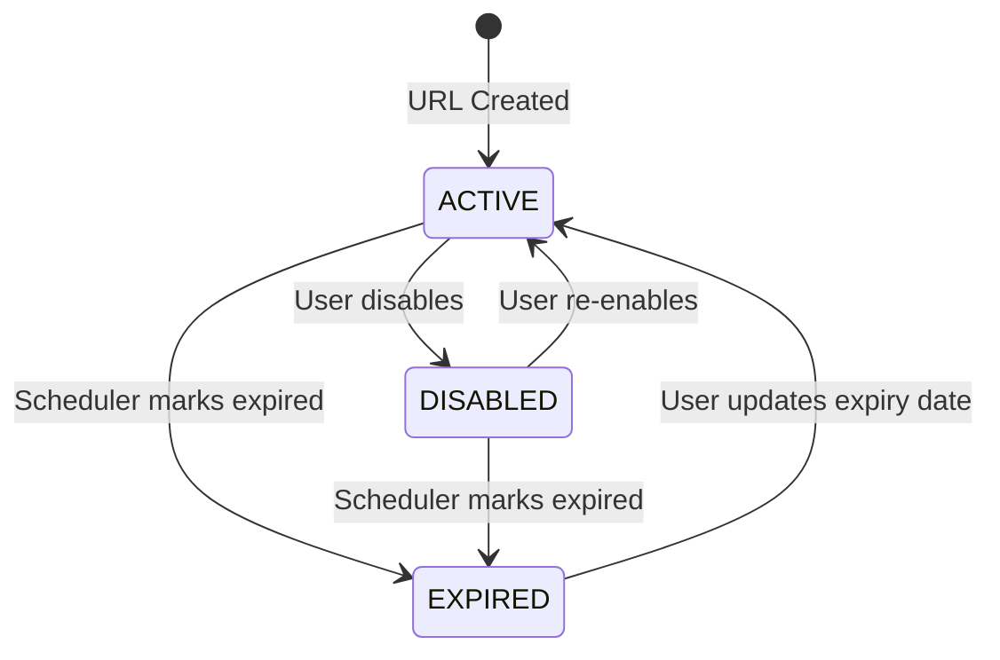
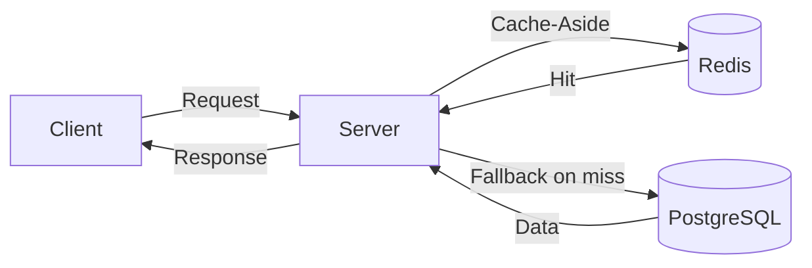

# 🔗 ScanShort — URL Shortener API

A Spring Boot REST API for shortening / managing URLs, tracking analytics, and generating QR codes — powered by Redis for high-performance redirects.

---

## 🔗 Quick Links
- Demo Link: [Demo](https://scanshort.netlify.app/)
- 📚 API Documentation: [Swagger UI](http://localhost:8080/swagger-ui.html) ← _replace with live URL after deployment_

---

## 🗄️ ERD

 ← _replace with actual ERD image_

---

## 🧠 Business Logic

### Guest
- Shorten any URL — gets an auto-generated short code
- Generate QR code for any short URL
- Link cached for 1 day with **sliding expiration** — TTL resets on every click, so active links stay alive while inactive ones expire naturally
- Link saved in DB and cleaned up after 30 days automatically
- No ownership — link can't be managed after creation

### Authenticated User
- Everything a guest can do, plus:
- Custom short code — create your own memorable code (e.g. `short.ly/my-link`)
- Create different codes for the same URL — useful for tracking traffic across different platforms (Twitter, Instagram, LinkedIn)
- Set expiry date — control how long your link lives
- Disable / Enable URL — control access without deleting
- Update expiry date — extend or change when link expires
- View analytics — track click count per URL

### URL Lifecycle



---

## ⚡ Challenges & Solutions

### 1. High-Performance Redirects

**Problem:** Since the redirect endpoint is the most consumed endpoint in the project, it had to be as fast as possible. Hitting the database directly on every redirect causes bottlenecks at high scale.

**Solution:**
- Introduced Redis caching — in-memory lookup is significantly faster than DB disk reads
- Utilized Cache-Aside pattern — check cache before hitting DB on every redirect
- Sliding TTL — most redirected links stay cached, inactive ones expire naturally
- Analytics tracked in Redis atomically — no DB writes on every redirect, flushed to DB every 5 minutes via scheduled job

**Result:** Cache hits serve redirects with zero DB queries, making the redirect endpoint handle high traffic efficiently.

---

### 2. Real-time Analytics Without DB Bottleneck

**Problem:** Tracking view counts per shortened URL can cause serious performance issues at high scale if we write to the database on every redirect — especially since redirect is the most critical endpoint as mentioned above.

**Solution:**
- Tracked view counts in Redis using atomic increment — no DB writes per click
- Scheduled job flushes all view counts to DB every 5 minutes automatically
- On graceful shutdown, remaining counts flushed immediately via @PreDestroy

**Result:** View counts tracked accurately in real-time without any impact on redirect performance.

---

### 3. Unique Code Generation

**Problem:** Generating unique short codes for millions of URLs without collision — even under concurrent requests where two or more users could try to shorten a URL at the same millisecond.

**Solution:**
- Maintained a global counter to track the number of generated URLs
- Solved the concurrency problem using Redis INCR — an atomic operation that guarantees no two requests get the same value simultaneously
- Kept DB synced with Redis transactionally on every increment — survives Redis crashes without losing counter position
- On server startup, counter restored from DB automatically — prevents counter resetting to zero after a crash
- Counter converted to Base62 — supports 56 billion unique codes and makes codes unpredictable to end users

**Result:** Zero collision risk under any traffic level, with graceful recovery from Redis failures.

---

### 4. Rate Limiting

**Problem:** Some endpoints like login are vulnerable to brute force attacks, URL creation is vulnerable to spam, and the system in general is vulnerable to DoS attacks — all of which can degrade performance or compromise security.

**Solution:**
- Built a custom @RateLimit annotation powered by Spring AOP — applied declaratively on any endpoint without touching business logic
- Dual protection — rate limiting by IP (system protection) and by email (account protection)
- Fully configurable per endpoint: maxAttempts, windowSeconds, blockSeconds

**Result:** Login protected against brute force, system protected against spam and DoS attacks — zero impact on normal users.

---

### 5. Duplicate URL Detection

**Problem:** Checking if a user already shortened the same URL requires comparing full URL strings — which can be very long, expensive to index, and slow to query at scale.

**Solution:**
- Stored a SHA-256 hash of the original URL alongside it in DB
- Indexed the fixed 64-character hash instead of the full URL string
- Duplicate detection query uses composite index (user_id, base_url_hash) for O(1) lookup regardless of URL length

**Result:** Fast and storage-efficient duplicate detection — URL length has zero impact on query performance.

---

## 🚀 Features

- URL shortening for guests and authenticated users
- QR code generation for any short URL
- Real-time view count analytics per shortened URL
- Rate limiting to prevent abuse and brute force attacks
- Custom short codes and duplicate link support
- Expiry date management with auto-expiry
- Disable / Enable URLs without deleting them
- Paginated and filtered URL management
- Fully containerized with Docker & Docker Compose

---

## 🏗️ Architecture



### Key Design Decisions
- DTO-based API communication — no entity exposure to client
- CacheService abstracts all Redis operations — keeps business logic clean
- AOP for cross-cutting concerns — rate limiting applied declaratively without touching business logic
- Specification pattern for dynamic URL filtering
- Separate schedulers per responsibility — Single Responsibility Principle

---

## ⏰ Scheduled Jobs

| Scheduler | Frequency | Responsibility |
|---|---|---|
| ViewCounterScheduler | Every 5 minutes + on shutdown | Syncs view counts from Redis back to the database to keep analytics up to date |
| GuestUrlCleanupScheduler | Daily at midnight | Removes expired guest URLs from the database to keep it clean |
| UrlExpiryScheduler | Daily at midnight | Marks user URLs as expired once their expiry date has passed |

---

## 🧰 Tech Stack

| Layer | Technology |
|---|---|
| Backend | Spring Boot 4.0.5 |
| Security | Spring Security + JWT |
| Cache | Redis 7.4 |
| Database | PostgreSQL 17 |
| ORM | Spring Data JPA + Hibernate |
| Mapping | MapStruct |
| QR Code | ZXing |
| API Docs | OpenAPI (Swagger UI) |
| Containerization | Docker + Docker Compose |
| Build Tool | Maven |

---

## 🚀 Running Locally

### Prerequisites
- Docker & Docker Compose

### Steps

**1. Clone the repository:**
```bash
git clone https://github.com/ahmedessamrizk/scanshort.git
cd scanshort
```

**2. Create `.env` file in root directory based on `.env.example`**

**3. Run with Docker Compose:**
```bash
docker compose up -d --build
```

**4. Access:**
```
API Base URL  : http://localhost:8080/api/v1
Swagger UI    : http://localhost:8080/swagger-ui.html
Redis Insight : http://localhost:5540
```

---

## 📬 Contact

- GitHub: [@ahmedessamrizk](https://github.com/ahmedessamrizk)
- LinkedIn: [Ahmed Essam Rizk](https://www.linkedin.com/in/ahmed-essam7722/)
